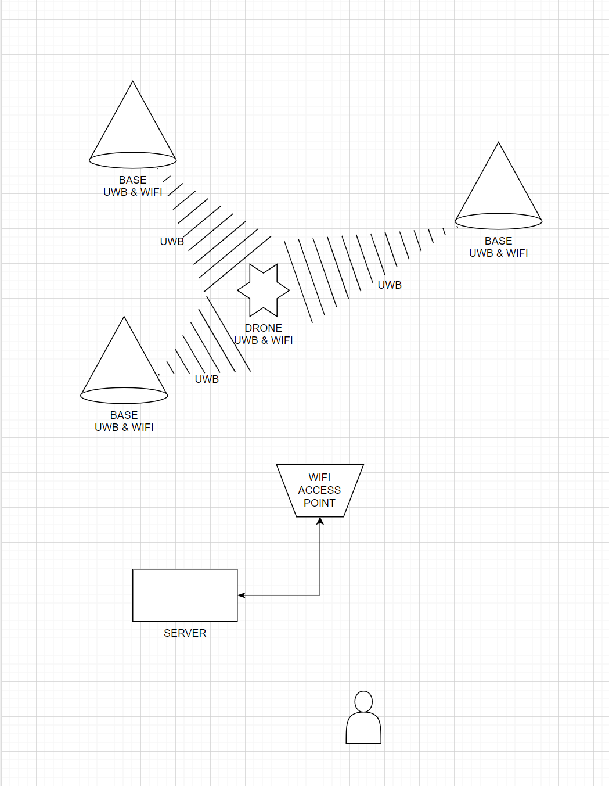
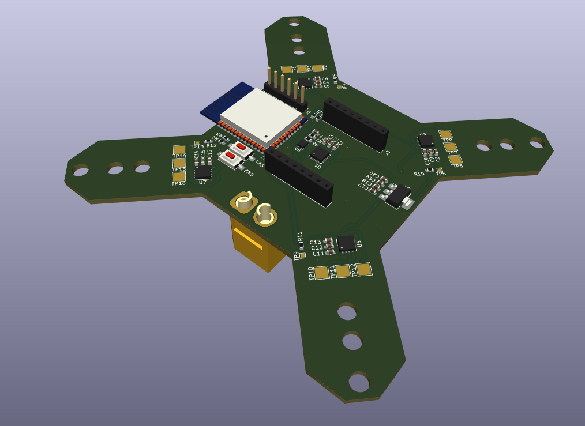
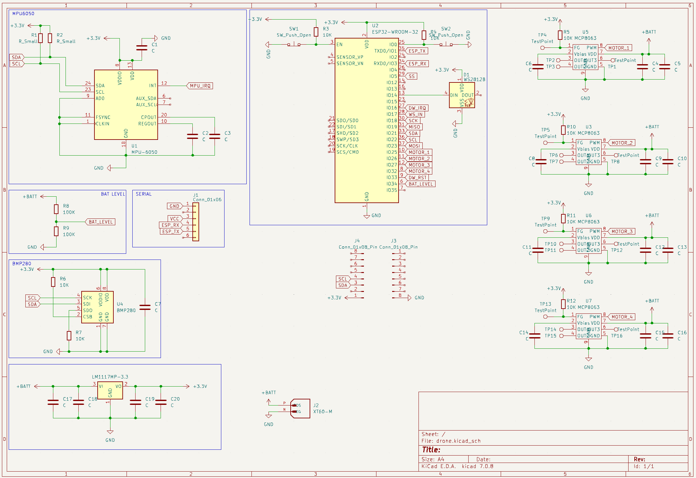
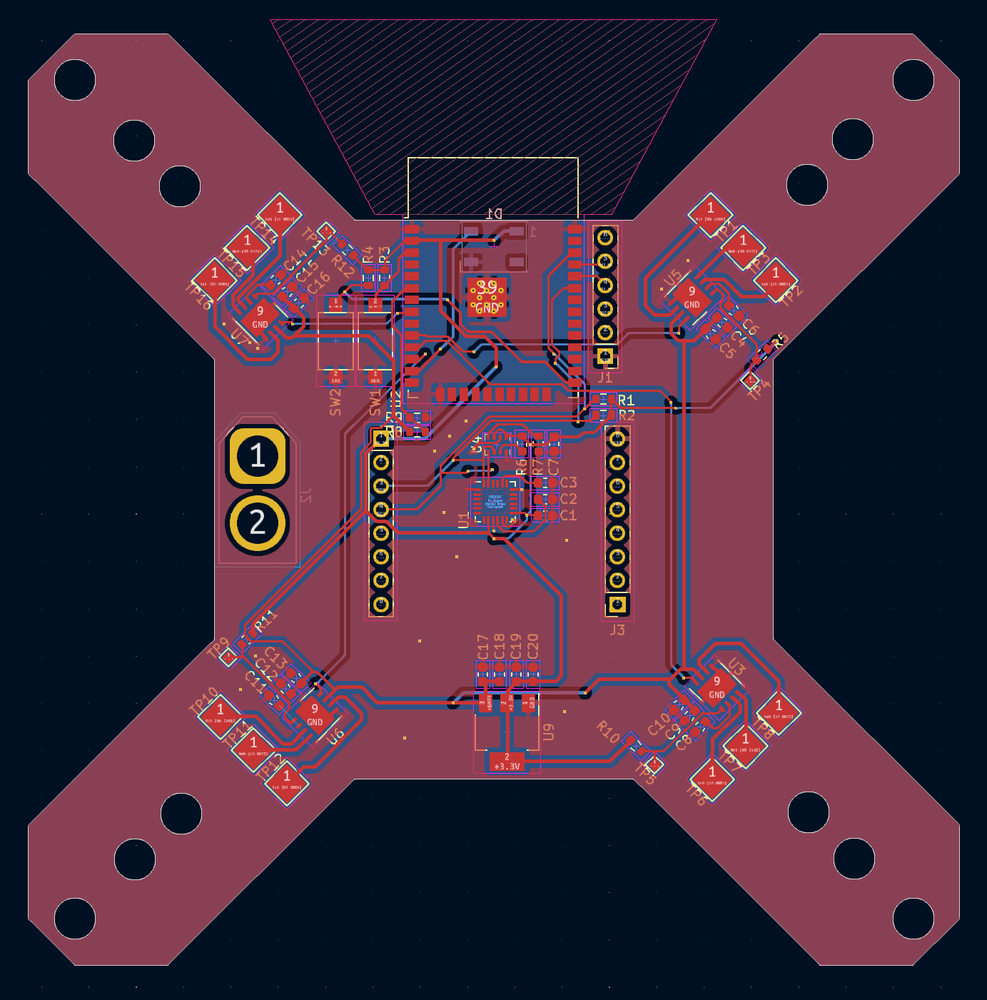

# AUTOMATIC DRONE FLY PROJECT

Thank you to [PCBWay](https://www.pcbway.com/) for sponsoring the PCB production of this prototype.

## FIRST VIDEO DEMO -> [VIDEO](https://youtube.com/shorts/m3bDPPfCCp4?feature=share)

## WITH MOTOR -> [VIDEO](https://youtube.com/shorts/Sa2Nf204R9k?feature=share)

## READY FOR FLY -> [VIDEO](https://www.youtube.com/shorts/XvAniwky4LE?feature=share)

### This project exist for make automatic positioning and flying with UWB (ultra wide band) technology

### Architecture

## DRONE NEW
#### 3D VIEW

#### SCHEMATIC VIEW

#### PCB VIEW

## DRONE OLD

##### This drone use Arduino code for fly and have is proper esc for little motors

#### SCHEMATIC VIEW

#### PCB VIEW

#### 3D VIEW

#### 3D DRONE

#### REAL PCB 

## BASE

##### This base use Arduino code for know distance between EACH drone and himself

#### SCHEMATIC VIEW

#### PCB VIEW

#### 3D VIEW

Thank you to [PCBWay](https://www.pcbway.com/) for sponsoring this project by covering the cost of PCB production for beta. The boards turned out very nicely. The green solder mask looks solid and the grills holes is perfect.