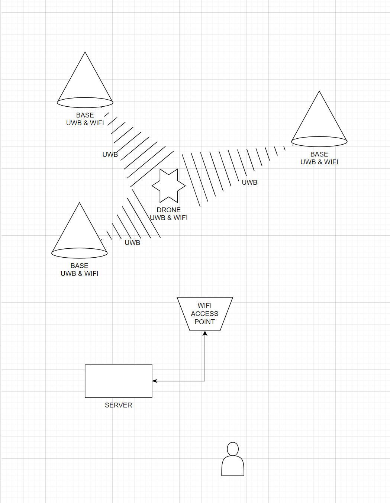
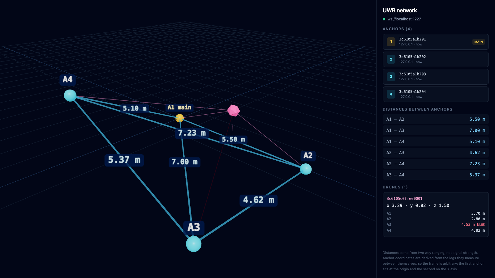

<div align="center">

# AUTOMATIC DRONE FLY PROJECT

**A quadcopter that knows where it is, to the centimetre, without GPS.**

Ultra wide band anchors on the ground, a tag on the drone, and time of flight
ranging between them.

[](base/code)
[](code/drone)
[](code/server)
[](code/front)
[](drone_with_esc)

### Demos

[First flight](https://youtube.com/shorts/m3bDPPfCCp4?feature=share) ·
[With motors](https://youtube.com/shorts/Sa2Nf204R9k?feature=share) ·
[Ready to fly](https://www.youtube.com/shorts/XvAniwky4LE?feature=share)

</div>

---

## How it works

GPS stops at the door and drifts by metres. Ultra wide band does not: a DW1000
timestamps a radio pulse to 15.65 picoseconds, which is 4.7 mm of flight time.
Measure the round trip between two radios and you get a distance, not a guess
from signal strength.



### The ranging cycle

Anchors are chained. A tag walks the whole chain on every cycle and comes out
with one distance per anchor:

```
   drone (tag)                anchors
        |
        |  blink  ------------------------------->  main anchor
        |  <---------------  short address  ------  main anchor
        |                                             |
        |  <====  two way ranging  ====>  anchor 1     | measures, reports
        |  <====  two way ranging  ====>  anchor 2     | measures, reports
        |  <====  two way ranging  ====>  anchor 3     | measures, reports
        |                                             |
        |  <-------------  back to blinking  -------  last anchor
```

Every anchor computes its own distance and pushes it to the server over UDP.
Three clear distances are enough to place the drone on a plane, four to place it
in space.

### The anchors also measure each other

Between tag cycles, each anchor plays tag towards its peers. That gives the
distance matrix of the installation itself, and the server turns it into
coordinates, so nobody has to measure a room with a tape:

```
   anchor 1 ---- 5.50 m ---- anchor 2        first anchor  -> origin
      |  \                    /  |           second       -> on the X axis
   5.10   7.00          4.62    7.23         third        -> in the XY plane
      |        \      /         |            the rest     -> trilaterated
   anchor 4 ---- 5.37 m ---- anchor 3
```

Distances alone cannot tell a layout from its mirror image, so the convention
above is part of the answer rather than a measurement.

### Why the distance can be trusted

| | |
| --- | --- |
| **Time of flight** | The distance comes from an asymmetric two way ranging exchange, not from RSSI. Typical accuracy is around 10 cm once calibrated. |
| **Bias correction** | The APS011 range bias table is applied to every measurement, worth 10 to 20 cm at short range. |
| **Median filter** | Each anchor reports the median of its last 5 exchanges, so a single multipath reflection cannot move the result. |
| **Line of sight check** | A measurement whose first path power sits more than 6 dB below the total receive power is flagged, and the server keeps it out of the position fix. |
| **Antenna delay calibration** | Stored per board in NVS and pushed over the network, see below. |

---

## Repository map

| Path | What it is |
| --- | --- |
| [`base/code`](base/code) | Anchor firmware, ESP-IDF. Runs the ranging chain and reports distances. |
| [`base/`](base) | Anchor board, with and without battery (KiCad) |
| [`code/drone`](code/drone) | Drone firmware, Arduino. Flight control, plus the UWB tag on its own task. |
| [`code/server`](code/server) | Bun server. Collects distances, solves the layout and the drone positions. |
| [`code/front`](code/front) | Web interface, Vue and TresJS 3D view |
| [`drone_with_esc`](drone_with_esc) | Drone board with 30 A ESCs (KiCad) |
| [`drone`](drone) | Drone board with integrated drivers (KiCad) |
| [`drone_2s`](drone_2s) | Drone board for a 2S battery (KiCad) |

---

## Quick start

### Anchors

Flash one board per anchor, each with its own address. One of them, and only
one, is the main anchor.

```sh
cd base/code
$EDITOR src/config.h     # wifi, server, ANCHOR_ADDRESS, ANCHOR_IS_MAIN
pio run -t upload
pio device monitor
```

The chain is described entirely in `src/config.h`. The last anchor sets
`ANCHOR_NEXT_ADDRESS` to 0, which sends the tag back to blinking:

```c
// anchor 1              anchor 2              anchor 3 (last)
ANCHOR_ADDRESS      1    ANCHOR_ADDRESS      2    ANCHOR_ADDRESS      3
ANCHOR_IS_MAIN      1    ANCHOR_IS_MAIN      0    ANCHOR_IS_MAIN      0
ANCHOR_NEXT_ADDRESS 2    ANCHOR_NEXT_ADDRESS 3    ANCHOR_NEXT_ADDRESS 0
```

### Drone

```sh
cd code/drone
$EDITOR src/config.h     # wifi, websocket endpoint
pio run -t upload
```

### Server and front

```sh
cd code/server && bun install && bun run src/index.ts
cd code/front  && bun install && bun run dev
```

The interface shows the anchors, the distances they measure between themselves
and the drones, in 3D. With no hardware running, open it with `?demo=1` to see
it against generated data.



---

## Radio profiles

Both ends of every link have to agree on every radio setting, so the profile
lives in a single file that is kept identical in
[`base/code/src/uwb_profile.h`](base/code/src/uwb_profile.h) and
[`code/drone/src/uwb_profile.h`](code/drone/src/uwb_profile.h).

| | **long range** (default) | **fast** |
| --- | --- | --- |
| Data rate | 110 kbps | 850 kbps |
| Preamble | 2048 symbols | 256 symbols |
| Pulse frequency | 64 MHz | 16 MHz |
| SFD | Decawave (non standard) | standard |
| Preamble code | 9 | 3 |
| Frame airtime | about 4 ms | about 0.5 ms |
| Link budget | about 6 dB better | baseline |
| Usable range | roughly 2x | baseline |
| Air time per cycle | roughly 8x more | baseline |

Switch by flipping `UWB_PROFILE_LONG_RANGE` and `UWB_PROFILE_FAST` in that
header, on every board. The channel (5) is the same on both, so the two profiles
share the same spectrum, just not the same air time.

> **Changing profile invalidates the antenna delay.** It depends on the pulse
> frequency, so a board calibrated at 16 MHz is not calibrated at 64 MHz. The
> anchors store the value under a per profile key so the two calibrations never
> get mixed up, but each one still has to be measured.

---

## Calibrating an anchor

Antenna delay is the single largest source of constant error. One unit is about
4.7 mm, so a board left on the generic 16436 is easily half a metre off, and no
amount of filtering will fix a constant offset.

1. Put an anchor and the drone at a known distance, in clear line of sight, both
   antennas in the same orientation.
2. Read what the anchor reports on its serial monitor.
3. Correct it. Roughly 213 units per metre of error, and a longer delay reports
   a shorter range, so increase it when the anchor reads long:

```sh
echo -n '{"antenna_delay": 16450}' | nc -u -w1 <anchor ip> 7051
```

4. Repeat until it settles. The value lands in NVS and survives reboots.

`DW1000_ANTENNA_DELAY` in `src/config.h` is only the fallback for a board that
has never been calibrated.

### Getting the rest of the accuracy

Calibration and filtering only go so far; the antenna installation does the
rest.

- No ground plane under the DWM1000 antenna, module on the board edge, 1 cm of
  clearance around it.
- Same antenna orientation on anchors and drone. Ninety degrees of rotation
  costs several dB of polarisation mismatch.
- Anchors high, with a direct view of the flight volume, not flat against a wall
  or on the floor.
- Solid decoupling: the DW1000 draws peaks of about 160 mA while transmitting.
- For a 3D fix, four anchors that are not coplanar. A barometer on the drone
  fixes the altitude and brings that back down to three.

---

## Protocol

Anchors talk to the server over UDP on port 7051, in both directions.

**Anchor to server**, wrapped in `{"uniq": "<anchor mac>", "type": ..., "data": {...}}`:

| type | data | when |
| --- | --- | --- |
| `anchor` | `{"address": 1, "main": true}` | at boot |
| `tag` | `{"eui": "aabbccddeeff0001", "address": 5}` | main anchor, when it hands a short address to a tag |
| `range` | `{"address": 5, "range": 3.42, "raw_range": 3.51, "rx_power": -82.3, "fp_power": -85.1, "los": true}` | every completed exchange with a tag |
| `peer` | same shape, `address` being another anchor | every completed exchange with a peer anchor |

**Server to anchor**:

| payload | effect |
| --- | --- |
| `{"reboot": true}` | restarts the board |
| `{"antenna_delay": 16450}` | stores a calibration in NVS and applies it |

A secondary anchor only ever sees the short address the main anchor handed out,
which is why the main anchor publishes the address to EUI mapping. The drone
announces the same EUI when it connects, and that is what ties a distance back
to a drone.

---

## Status

| | |
| --- | --- |
| Anchor firmware, ESP-IDF | builds, not yet flown |
| Two way ranging, both ends | builds, awaiting bench validation |
| Anchor self survey | builds, not yet flown |
| Distance collection on the server | working, covered by tests |
| Anchor layout and drone position | working, covered by tests |
| Web interface | working, 3D view of anchors, distances and drones |
| Autonomous flight | the goal |

---

## Hardware

### Anchors


<details>
<summary>Board views</summary>

**Schematic**


**PCB**


**3D**


</details>

### Drone with 30 A ESCs


<details>
<summary>Board views</summary>

**Schematic**


**PCB**


**3D**


</details>

### Drone with integrated drivers


<details>
<summary>Board views</summary>

**Schematic**


**PCB**


**3D**


**Real board**


</details>

### Drone for a 2S battery


---

## Credits

Thank you to [PCBWay](https://www.pcbway.com/) for sponsoring the PCB production
of this prototype. The boards turned out very nicely: the green solder mask
looks solid and the grill holes are perfect.

The DW1000 driver is a port of
[F-Army/arduino-dw1000-ng](https://github.com/F-Army/arduino-dw1000-ng) (MIT),
vendored in [`base/code/components/DW1000Ng`](base/code/components/DW1000Ng).
